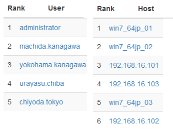
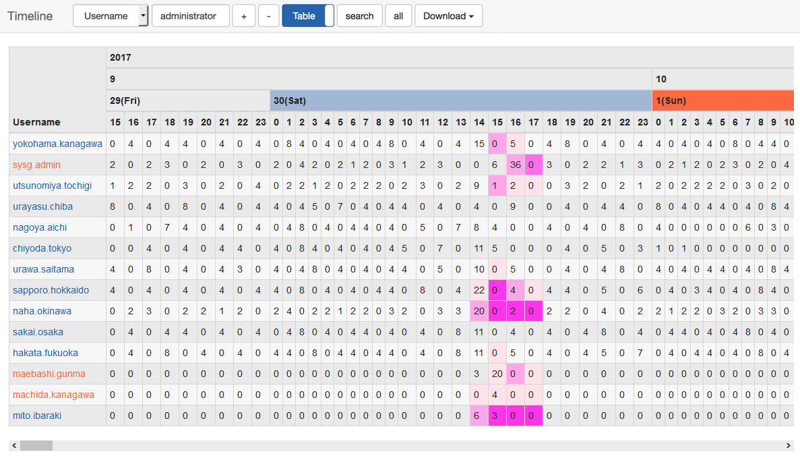

# LogonTracer
    
  Investigate malicious logon by visualizing and analyzing Windows active directory event logs.  

    

## Concept
  LogonTracer associates a host name (or an IP address) and account name found in logon-related events and displays it as a graph. This way, it is possible to see in which account login attempt occurs and which host is used.  
  This tool can visualize the following event id related to Windows logon based on [this research](https://www.first.org/resources/papers/conf2016/FIRST-2016-105.pdf).  
  * **4624**: Successful logon  
  * **4625**: Logon failure  
  * **4768**: Kerberos Authentication (TGT Request)  
  * **4769**: Kerberos Service Ticket (ST Request)  
  * **4776**: NTLM Authentication  
  * **4672**: Assign special privileges  

  More details are described in the following documents:     
  * [Visualise Event Logs to Identify Compromised Accounts - LogonTracer -](http://blog.jpcert.or.jp/2017/11/visualise-event-logs-to-identify-compromised-accounts---logontracer-.html)  
  * [イベントログを可視化して不正使用されたアカウントを調査](https://www.jpcert.or.jp/magazine/acreport-logontracer.html) (Japanese)

## Additional Analysis
  LogonTracer uses [PageRank](https://en.wikipedia.org/wiki/PageRank) and [ChangeFinder](https://pdfs.semanticscholar.org/c5bc/7ca31914d3cdfe1b2932cbc779875e645bbb.pdf) to detect malicious hosts and accounts from event log.  
    
  With LogonTracer, it is also possible to display event logs in a chronological order.  
    
## Use LogonTracer
  To use LogonTracer, you can:  
  * [Install](https://github.com/JPCERTCC/LogonTracer/wiki/how-to-install)
  * [Use docker](https://github.com/JPCERTCC/LogonTracer/wiki/jump-start-with-docker)

## Documentation
  If you want to know more details, please check [the LogonTracer wiki](https://github.com/JPCERTCC/LogonTracer/wiki).

## Architecture
  LogonTracer is written in Python and uses Neo4j for database. The following tools are used.  

  * Python 3
  * [Neo4j](https://neo4j.com) for a graph database.  
  * [Neo4j JavaScript driver](https://github.com/neo4j/neo4j-javascript-driver) for connects to Neo4j using the binary protocol.  
  * [Cytoscape](http://www.cytoscape.org/) for visualizing a graph network.
  * [Flask](http://flask.pocoo.org/) is a microframework for Python.
